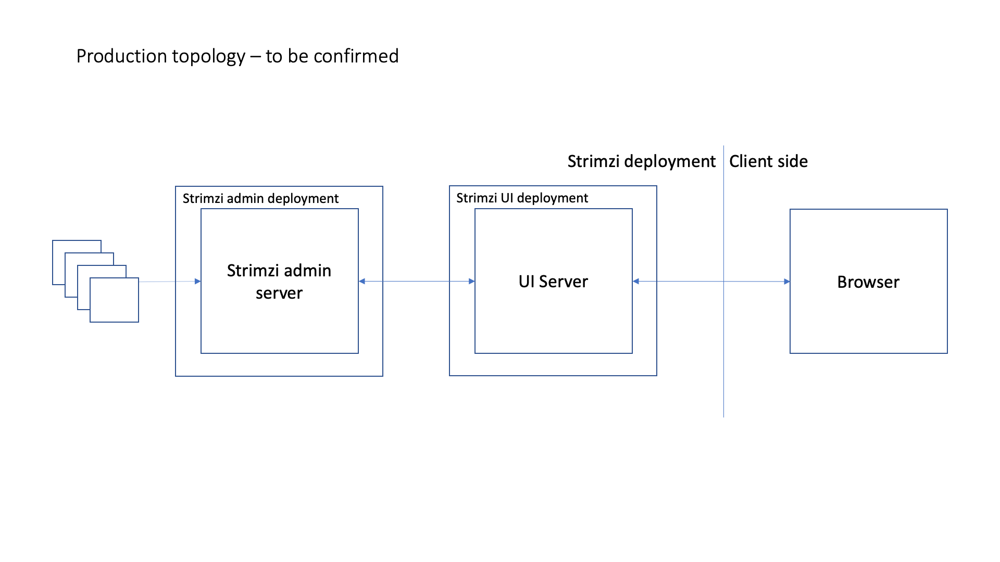
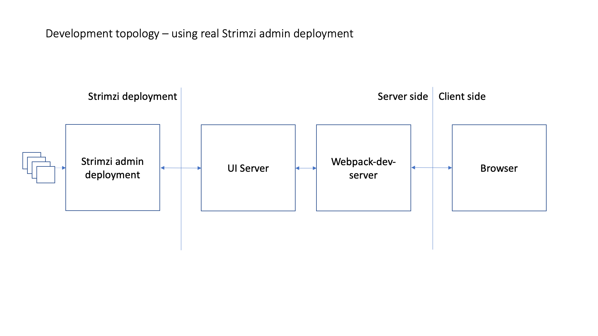
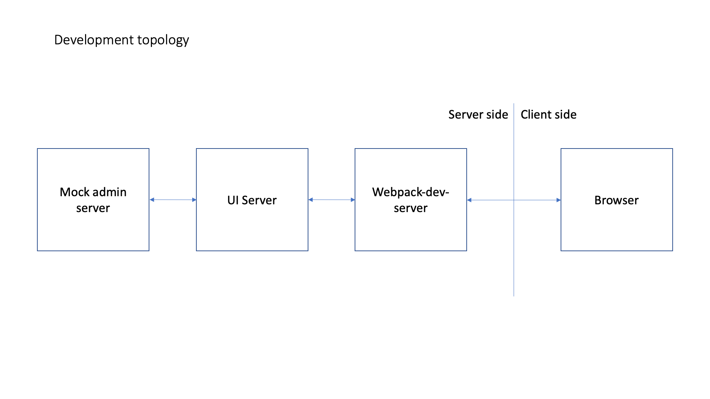
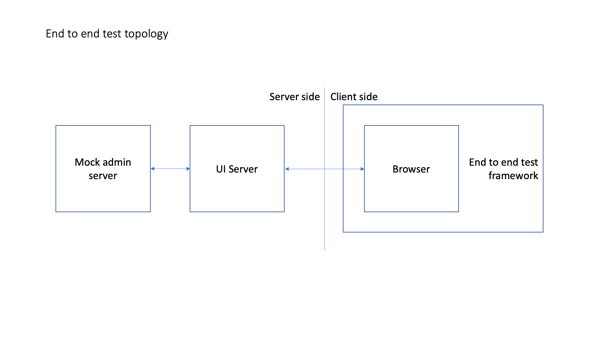

# Architecture

This document will cover the core Architectural decisions made for this UI, how aspects of the UI integrate together and work, as well as detail how the UI then integrates with a Strimzi deployment.

## Contents

- [Overview and objectives](#overview-and-objectives)
- [Topology](#topology)
  - [Production](#production-topology)
  - [Development and test](#development-and-test-topology)
- [Security](#security)
- [Transport layer](#transport-layer)
- [Strimzi integration](#strimzi-integration)
- [Implementation details](#implementation-details)
  - [Front end (client)](#client)
    - [Technologies and patterns used](#client-technologies-and-patterns-used)
    - [File name conventions](#file-name-conventions)
    - [Routing and navigation model](#routing-and-navigation)
    - [GraphQL Introspection](#introspection)
    - [Component topology](#component-topology)
    - [Logging](#client-side-logging)
  - [Back end (server)](#server)
    - [Technologies and patterns used](#server-technologies-and-patterns-used)
    - [`Router`, `Controller`, `Data` pattern](#router-controller-data-pattern)
    - [Logging](#server-side-logging)
  - [Entity model](#entity-model)
  - [Configuration and feature flagging](#configuration-and-feature-flagging)
    - [Configuration types and usage](#configuration-types-and-usage)
    - [Client specific configuration](#client-configuration)
    - [Server specific configuration](#server-configuration)
    - [Feature flags](#feature-flags)
- [Code structure](#code-structure)
  - [Directory structure](#directory-structure)
  - [`Element`, `Group`, `Panel`, `Bootstrap` component pattern](#element-group-panel-bootstrap-component-pattern)
  - [Swappable view layers](#swappable-view-layers)
  - [Dependency management](#dependency-management)
- [Supporting utilities and tools](#supporting-utilities-and-tools)
  - [Storybook](#storybook)
  - [Mock admin server](#mock-admin-server)

### Overview and objectives

The purpose of this UI is to provide a user of Strimzi a web UI for Kafka administration. To achieve this, focus of course needs to be placed on things like the design to make the UI intuitive to use. However, user experience is more than just the design: it also is the code, and it's ability to enable those experiences. The following documentation will detail the deliberate design, engineering and behavioural choices made to achieve this objective.

In addition, we have set the following behaviours/goals/considerations for all development done in this repository:

- Focusing on the user, be they developer or end user, at all times
- To make the codebase as approachable as possible through the use of consistent and intuitive style, and supporting documentation
- To make the codebase extensible and configurable
- Adopting a cloud like CI/CD development model: lots of small and often changes, appropriately flagged, with the `master` branch being shippable at any time
- Use automation as much as possible to maintain a CI/CD model - things like automated dependency updates, issue management etc

### Topology

The following section will detail how the UI in this repository integrates with related/supporting components when deployed in production, but also at development and test time. A client side [component topology can be found here.](#component-topology)

#### Production topology

_Further details will be added to this section once https://github.com/strimzi/proposals/pull/6 has been finalized._

_Proposal_: The UI when deployed as a part of Strimzi could look as follows:



Where:

- The UI deployment hosts the UI server
- The UI deployment is configured to reference an instance of Strimzi admin deployed to serve UI backend requests
- The UI server hosts the built UI and public assets, and serves these to clients
- The UI server integrates and enforces (if configured) Authentication and Authorization checks, as well as user session management
- The UI server proxies requests to the configured Strimzi admin deployment

The responsibility of the UI server is to validate and handle client requests, and to abstract the backend from the client. As mentioned, this validation could range from authentication challenges, to validating proper use of HTTP headers. Abstracting the backend enables flexibility in deployment, and could enable use cases where one UI interacts with many instances of Strimzi admin.

#### Development and test topology

When run under development or end to end test scenarios, the UI topology is as similar as possible to a production deployment as possible. However, there are a few differences, as shown in the below diagram(s):




In both cases, `webpack-dev-server` hosts the development UI (rather than the UI Server), and proxies any requests it does not recognise to the instance of the UI server. The UI server then operates as it would in a normal production deployment. As shown in the diagram, the UI server could then be configured to send backend requests to either a 'real' Strimzi admin instance, or [a mock version of Strimzi admin to enable local development.](#mock-admin-server). In the case of end to end testing, this mock backend will be used, so deterministic behaviour can be guaranteed during the test.



Further details will be added to this section once https://github.com/strimzi/proposals/pull/6 has been finalized.

### Security

This section builds upon the contents of the [Strimzi UI proposal](https://github.com/strimzi/proposals/blob/master/011-strimzi-ui.md#session-management-and-authentication) and [Strimzi UI and Admin security proposal](https://github.com/strimzi/proposals/blob/master/010-UI-and-admin-server-security.md).

The UI needs to concern itself with two key parts of security - authentication (who am I) and authorization (what can I do). A Strimzi Kafka cluster can be configured to provide either just authentication (you need user credentials), or authentication and authorization (user credentials with access control).

The UI server will not communicate directly with the Kafka cluster, but instead perform actions via a Strimzi admin deployment. As such - the UI will need to provide valid credentials to Strimzi admin on behalf of the current user.

The UI could simply make requests assuming authorization and handle cases when permission is denied. However, this would provide a poor UX. To avoid this, the UI will instead introspect the user's permissions and disable features accordingly.

A user should only have to enter/generate credentials once - so there must be a persistent session while they are using the UI that contains their credentials. These can be forwarded on to Strimzi admin on any request.

The following capabilities will be implemented:

- Mechanism to supply connection details for a cluster (connection to Strimzi admin server), that contains authorization and authentication types
- Mechanism to support authentication via an OAUTH identity provider (keycloak initially)
- Mechanism to introspect a user's access scope (either through Strimzi admin or keycloak directly)
- Create and maintain a session for the user
- Present user credentials when communicating with Strimzi admin
- Identifiying when user credentials are no longer valid
- Removing user credentials/ending a session

### Transport layer

The Strimzi UI makes use of both HTTP and WebSockets. This section details what each protocol is responsible for.

#### HTTP

Currently, HTTP is used to retrieve static assets from the UI server, as well as serve [GraphQL](https://graphql.org/) queries. In a following PR, all GraphQL requests (including queries) will be made via a Websocket, [as per the UI proposal](https://github.com/strimzi/proposals/blob/master/011-strimzi-ui.md#session-management-and-authentication).

#### WebSockets

[Logging](#client-side-logging)

Client logs are sent to the UI server over a persistent websocket so that the logs of both components can co-exist.

##### Future work

In due course, all [GraphQL](https://graphql.org/) requests will be done over a WebSocket, even standard queries. WebSockets are required by GraphQL to do subscriptions. Subscriptions allow the client to listen for data changes from the server so that it can stay updated in real-time. All other queries are bundled into the same websocket so a clean network traffic log can be kept. The WebSocket will be held with the UI server, which will then proxy any websocket messages to the GraphQL admin server. This proxy allows for custom Apollo errors to be injected into the websocket so that the client can handle additional errors such as session expiration. The proxy is also responsible for injecting an authorization header for the client so that a connection can be established to the admin server. For full details of the WebSocket flow, [view our proposal](https://github.com/strimzi/proposals/blob/master/011-strimzi-ui.md#session-management-and-authentication).

### Strimzi integration

This will be completed once https://github.com/strimzi/proposals/pull/6 has been finalized.

### Implementation details

This section will detail implementation and design choices made for both the [client](#client) and the [server](#server) for this UI. The [entity model](#entity-model) and [configuration/feature flagging](#configuration-and-feature-flagging) sections apply to both [client](#client) and [server](#server).

#### Client

This section will detail the high level design choices made when designing and implementing this UI.

##### Client Technologies and patterns used

A modern UI is made up of and enabled by many different technologies and implementation patterns. This section will detail what tools have been used to implement this UI, with a brief rationale to why.

This UI makes use of:

- The [Model View Controller (MVC)](https://en.wikipedia.org/wiki/Model%E2%80%93view%E2%80%93controller) design pattern: this pattern encourages the separation of business, rendering and (flow of) control logic. This fits naturally with UI implementations, where rendering, dealing with user action and modification of state are all separate concerns.
- [React](https://reactjs.org/) to implement the UI, due to it's declarative and composable approach to implementing UIs. In particular, we will leverage:
  - Functional React components: enforces a functional style to component writing, and avoid common pitfalls of class based component implementations - such as misuse of lifecycle methods
  - React Context: to provide state management/access
  - React Hooks: to enable shareable common logic across components
  - React Lazy and Suspense: to enable asynchronous loading of component code where required
- [Sass](https://sass-lang.com/) for styling. This adds a number of helpful features on top of the core css language to commonise and speed up style implementation
- Webpack and Typescript for building, bundling, treeshaking and transpiling the UI, and enabling day to day development. See [the build documentation](./Build.md#UI-build) for further details on build choices and setup.
- [`Barrel files`](https://basarat.gitbook.io/typescript/main-1/barrel) and named exports. Barrel files (when combined with [path mapping](./Build.md#module-aliases)) allow for many components/modules/functions/constants which are related to be imported and used via one import statement. This relies on exported components/modules/functions/constants to be individually named so they can be imported directly.
- [`React Router`](https://github.com/ReactTraining/react-router) for it's declarative routing capabilities.
- [Apollo](https://www.apollographql.com/) for enabling rich communication with a GraphQL server.

##### File name conventions

As mentioned above, the Strimzi UI, inspired by the MVC pattern, separates business logic from rendering logic. This means a component's logic will be split across multiple files. In addition, for capabilities such as [swappable view layers](#swappable-view-layers) to work, file names need to be known and consistent. Thus, a set of file name conventions should be followed to not only enable these capabilities, but also to standardise and make the codebase more approachable.

| Filename                                     | Contains/used for                                                                                                                                                                                                                                                  | Alias (if available) |
| -------------------------------------------- | ------------------------------------------------------------------------------------------------------------------------------------------------------------------------------------------------------------------------------------------------------------------ | -------------------- |
| `index.ts`                                   | Barrel file. Used to export modules/components/functions.                                                                                                                                                                                                          |                      |
| `types.ts`                                   | Barrel file. Used to export module/component types.                                                                                                                                                                                                                |
| `View.<suffix>.ts` / `View.ts`               | Contains React component rendering logic. This can have a view layer suffix if different view layer implementations are required [(see table for details)](#swap-able-view-layers). Should be a functional component.                                              | View                 |
| `Styling.<suffix>.(s)css` / `Styling.(s)css` | Styling code. This can have a view layer suffix if different view layer implementations are required [(see table for details)](#swap-able-view-layers).                                                                                                            | Styling              |
| `Model.ts`                                   | Business logic, implemented as a React Hook.                                                                                                                                                                                                                       | Model                |
| `Context.ts`                                 | React Context component implementation. See the [Contexts](../client/Contexts/README.md) for details.                                                                                                                                                              | Contexts             |
| `Hook.ts`                                    | React custom hook implementation. See the [Hooks](../client/Hooks/README.md) for details.                                                                                                                                                                          | Hooks                |
| `<name>.feature`                             | Feature (spec) file for this component. Used to describe the behaviours of the component in user stories/goals.                                                                                                                                                    |                      |
| `<name>.steps.ts`                            | Test file used to implement the `<name>.feature` file.                                                                                                                                                                                                             |                      |
| `<name>.spec.ts`                             | (Unit) test file for component/utility it sits in.                                                                                                                                                                                                                 |                      |
| `<name>.stories.ts`                          | [Storybook](#storybook) story implementation. Required for all components.                                                                                                                                                                                         |                      |
| `<name>.assets.ts`                           | Common utility code - for use in tests, storybook. Can also define (and have as a part of the exported content) constant values.                                                                                                                                   |                      |
| `<name>.types.ts`                            | All component types (both private and exported ).                                                                                                                                                                                                                  |                      |
| `<name>.page.ts`                             | Page metadata module. Should only be present in the `Client/Pages` directory. See [here for more details](../client/Pages/README.md).                                                                                                                              | Pages                |
| `router.ts`                                  | UI server express logic. Maps a context route or routes to a `controller` to perform the request. See [here for more details.](#router-controller-data-pattern)                                                                                                    |                      |
| `controller.ts`                              | UI server business logic. Performs an action given an HTTP/WS request from a `router`. If the action is to return data, its should do so using a structure defined in a corresponding `data.ts` file. See [here for more details](#router-controller-data-pattern) |                      |
| `data.ts`                                    | UI server data response shapes/helper logic. Where a controller wants to return a response, the shape/logic to produce that shape should be defined here. See [here for more details](#router-controller-data-pattern)                                             |                      |

##### Routing and navigation

The Strimzi UI features routing and navigation support for all pages in the UI. This is implemented via the use of [`React Router`](https://github.com/ReactTraining/react-router) in the [`Navigation` Bootstrap component](../client/Bootstrap/Navigation/README.md), combined with [metadata which describes the pages which make up the UI](../client/Pages/README.md). Each page describes itself declaratively, including but not limited to; what it is called, which path it should reside on, how it should be rendered, and what requirements from a backend and security point of view it has. This enables pages, and their structure/relationship to other pages, to be not only more loosely coupled, but easily extensible.

Further details on how the metadata and navigation work can be found below:

- [`Navigation` component](../client/Bootstrap/Navigation/README.md)
- [Page metadata structure](../client/Pages/README.md)

##### User Authentication

The UI will support two forms of user authentication - OAuth and SASL. The OAuth flow will redirect the browser to a login page owned by the identity provider and thus the UI does not have to render any login pages. For SASL, the Strimzi UI will render a login form, using Strimzi admin to verify the credentials as part of the login flow.

To support this, the UI will provide a top level `/login` route, and a `/` route for the main 'Application'. This allows the UI to render a `/login` page without needing to fully load the main application (the `/` route will not match, this will not render the main components).

##### Introspection

In a typical web UI, client code often has awareness/needs to assume what backend services are available to support the use cases it provides. For example, if a Topics administration page is provided, the client code knows of/expects a backend to expose an API to support the listing, creation, deletion and modification of Topics. If one of these APIs is not available/has not been deployed, a user may for instance try to edit a topic (for instance), only to have the request fail when the user completes their task, thus giving the user a poor experience. If the UI discovered this lack of API sooner, the user could be notified or have capabilities not shown to avoid this case. However, it is not typical in a RESTful API to have or provide a discovery API.

Similarly, through the use of feature flags or more general configuration, capabilities of a UI which require a backend API (which may not be implemented or temporarily disabled) can be disabled themselves. The challenge with these approaches however can be the amount/granularity of the configuration required, and how this is relayed to the UI at runtime.

GraphQL servers use a schema to describe the available types, their attributes, and how these can be manipulated (called mutations). Given this schema is retrievable at runtime, it can be inspected to determine what backend capabilities are available. This is known as [introspection](https://graphql.org/learn/introspection/).

The Strimzi UI will perform an introspection of the backend server when it first loads in the user's browser. It will compare the retrieved schema to a model defined in the UI, and will store the result in a [React Context](../client/Contexts/Introspect/README.md) for use across the UI. This will allow the UI to then configure itself to show or hide capabilities based on what the backend supports. Examples of this include:

- By the navigation (in combination with the [#entity-model](#entity-model)) to show or hide whole pages if a minimum set of backend requirements are not met
- By the [feature flag capability](#configuration-and-feature-flagging) in the UI to enable and disable individual features based on backend capability
- By individual `Bootstrap`, `Panel` or `Group` components on a use case by use case basis

###### User Authorization

When the UI is configured to point to a Strimzi cluster with OAuth2.0(Keycloak) or OPA authorization, the UI will be able to request authorization details for the current user. This can be used for two purposes:

1. Request user permissions when the page first loads - and augment the entity model to deny capabilities based off authorization
2. Perform one off authorization checks against a particular resource - for example, when visiting a topic by a bookmark

In a simple authorization (KafkaUser) scenario, authorization checks will always return `true` because the UI backend will not be able to intropsect the user.

##### Component topology

This section to follow in a future PR.

##### Client-side logging

Log messages from the client are sent to the server via a dedicated websocket. Logging and the websocket connection are enabled when the `LOGGING` query parameter exists in the URL. The `LOGGING` query parameter is detected by a Logging Hook, which provides a logging callback used in components/code on the client side. The value of the `LOGGING` query parameter is a regex that is used to determine which components and code are logged. Each client component registers it's own name via the logging callback, and if that name matches the `LOGGING` query parameter regex, any log messages emitted by the client component are sent over the websocket.

The logging callback includes a `level` string argument that matches the [pino logging-levels](https://github.com/pinojs/pino/blob/master/docs/api.md#level-string), a `message` argument, and a list of inserts that are String-converted and included with the message.

At the server, a websocket listener on the `/log` endpoint logs the received client-side log events via the [pino](https://github.com/pinojs/pino) logging library at the logging-level provided to the logging callback. Each log event includes the following information:

- the client component name.
- the client-side timestamp recorded when the client-side logging callback was invoked.
- the server-side timestamp recorded when the websocket log event was received.
- a unique client ID that is tied to the websocket client to allow log events from the same client to be grouped together.
- the log event message from the client component code.

#### Server

This section will detail the purpose and implementation choices made around the Strimzi UI's UI server.

##### Server Technologies and patterns used

The server, like the client code, makes use of a number of technologies and pattern(s). These are detailed below, along with a summary to what they provide.

- The node.ts http(s) server modules ([http module](https://nodejs.org/api/http.html), [https module](https://nodejs.org/api/https.html)) to provide the core of the server, which can be configured as required given [the provided configuration](#configuration-and-feature-flagging)
- [Redis](https://redis.io/) to provide (ephemeral) session persistance
- [express](https://expressjs.com/) to provide routing and middleware support for a given http(s) server. Some of the middleware will include:
  - [Helmet](https://helmetjs.github.io/) to provide common/best practice HTTP header security options/settings
  - [express-session](https://github.com/expressjs/session) and [connect-redis](https://github.com/tj/connect-redis) for session management and simple Redis integration
  - [body-parser](https://github.com/expressjs/body-parser) and [cookie-parser](https://github.com/expressjs/cookie-parser) for additional request parsing and sanitisation
  - [passport.js](http://www.passportjs.org/) for user authentication and authorization
- [node-http-proxy](https://github.com/http-party/node-http-proxy) to provide HTTP and WS proxy support
- [pino](https://github.com/pinojs/pino) and [pino-http](https://github.com/pinojs/pino-http#readme) to provide fast, low-overhead logging and HTTP request logging respectively. The [pino-pretty](https://github.com/pinojs/pino-pretty) module can be used to prettify the logging output.
- Code, defined in modules based on their responsibility, further separated into a [`Router`, `Controller`, `Data` pattern](#router-controller-data-pattern), a form of the [Model View Controller (MVC)](https://en.wikipedia.org/wiki/Model%E2%80%93view%E2%80%93controller) design pattern for keeping express, business, and additional data fetching logic separate

##### `Router`, `Controller`, `Data` pattern

The UI server has been split into separate modules to deliberately separate the different types of logic/areas of responsibility. These modules, their responsibilities and configuration details are listed below.

| Module  | Responsibility                                                                                                                                                                                                                                                      | Configuration key (`modules.<name>`) | Context root |
| ------- | ------------------------------------------------------------------------------------------------------------------------------------------------------------------------------------------------------------------------------------------------------------------- | ------------------------------------ | ------------ |
| api     | Event handlers which will proxy GraphQL requests onto `Strimzi-admin`                                                                                                                                                                                               | api                                  | `/api`       |
| config  | Event handlers which provide a GraphQL API to retrieve all Strimzi UI configuration values                                                                                                                                                                          | config                               | `/config`    |
| core    | The core Express server, responsible for bringing in all other modules, providing logging and auth checking capabilities as well common security settings. This is always enabled/present.                                                                          | N/A                                  | N/A          |
| client  | Event handlers for serving the built client code to a web browser (the content of `dist/client`). Not enabled in dev mode, as `webpack-dev-server` will host client content.                                                                                        | client                               | `/`          |
| mockapi | A mock implementation of the `Strimzi-admin` server. In addition to the implementation of the `Strimzi-admin` api, it also will provide additional dev/test handlers which can control server behaviour. Used in development and test scenarios, not in production. | mockapi                              | `/api`       |
| log     | Event handlers for client logging delivery                                                                                                                                                                                                                          | log                                  | `/log`       |

The modules themselves are split into a number of files, each of which are responsible for one aspect of handling a request. These responsibilities and files are:

- `router` - express server logic to tie a route to a handler, defined in a `controller`. The core express server will interact with the `router` only. This keeps all express logic in one file
- `controller` - any business logic which should run when a root is called. This takes the form of an [`express middleware` function.](https://expressjs.com/en/guide/writing-middleware.html)
- `data` - if the controller needs to return data, those shapes should be defined in `data` files, which are returned/used by the `controller`

Thus, a module (`foo`) which contributes to the UI server would look as follows in the repository:

```
server/
  foo/
    index.ts
    router.ts
    controller.ts
    data.ts
    ...
```

As mentioned, the core module will import and interact with any other module's `router` via the `index.ts` barrel file. Further details of this interaction can be found in [the core module's README.](../server/core/README.md)

##### Server-side logging

Server-side logging uses the [pino](https://github.com/pinojs/pino) logging library to emit logging events to STDOUT. Logging configuration is managed via the [`logging` configuration object](#server-configuration), which is added to the default [pino options](https://github.com/pinojs/pino/blob/master/docs/api.md#options).

Each module in the server uses it's own [child logger](https://github.com/pinojs/pino/blob/master/docs/child-loggers.md) to allow simple filtering of logging events by module in post-processing. To allow more fine grained log filtering [pino-filter](https://github.com/pinojs/pino-filter) is included in the project dependencies, but is not used by default.

All HTTP requests are logged at the `info`-level using [pino-http](https://github.com/pinojs/pino-http#readme) which hooks into the express server, allowing requests and responses to be easily correlated.

Modules should infrequently log at the `warning` or `info` levels, as these messages will appear in the default log configuration. Most module level logging should be at the `debug` or `trace` levels. The `fatal` and `error` level logging messages should only be used when there are fundamental failures in the server code.

##### User management

`Passport.js` is an Express compatible authentication and authorization layer. It uses the concept of `strategies` to specify how to check credentials. Express routes can then be protected using a middleware function that handles validating and storing user credentials.

###### Authentication

When connecting to a Strimzi cluster with OAuth (keycloak) - the UI will use an OAuth strategy. This will redirect the user to the provider to log in - and start an OAuth flow. When the user has entered credentials into the provider - the browser is redirected back to Strimzi UI on a specific endpoint, and the Express server communicates with the provider to generate an access token for the user.

When connecting to a Strimzi cluster with SASL - the UI will use a `local` strategy and expose a GET and POST `/login` express route. If the user has not logged in, the passport `authenticate` function will redirect to the `/login` endpoint which will return the application bundle. The browser will render a login page - which will POST to the `/login` endpoint to authenticate the credentials. This strategy will then send the credentials to Strimzi admin to validate.

Passport strategies will also write a user object to the express `req.user` - which contains information about the user (basic profile and credentials).

###### Authorization

If the Kafka cluster uses simple authorization, it will not be possible introspect a user's permissions. Instead, requests will fail with a 403 status code, which the UI will need to handle.

If the Kafka cluster uses Keycloak or OPA authorization the UI will configure the Passport strategy for [authorization](http://www.passportjs.org/docs/authorize/). Once a user has been authenticated, the strategy `verify` callback can be used to lookup the authorization for the user and add it to the `req.account` object.

An `auth` graphql query field will then be created to allow the permissions to be retrieved by the browser when the application loads. An additional `auth` query with resource variale will be creatd for "one time" authorization checks.

###### User session

In a web application, the browser is making a series of requests on behalf of a user session. It would not be feasible to ask for credentials for _every_ request. Instead, Passport will be integrated with [express session middleware](https://github.com/expressjs/session) - which is used to provide a shared object across requests from the same client. The middleware adds a cookie to the first request that identifies the session, and will deserialize the correct shared object into the `req` object in subsequent requests. On first authentication, Passport will serialize user information into the session, ensuring that subsequent requests can access the user's credentials when it makes requests to Strimzi admin. In addition, Passport will trigger authentication if it finds that the credentials have expired or are missing.

The session will initially be stored inside an in memory store, as it is not a major problem for a user to reauthenticate if the server restarts. This can be later updated to use a persistent store for the session data.

###### Downstream authentication

Any requests that are made against Strimzi admin will provide the credentials stored in the user session. If there is a timing window whereby the credentials expire after they have been attached to the request, the UI will handle the authentication failure and trigger a reauthentication.

#### Entity model

A UI typically allows a user to interact with resources. These resources are types of known entity (E.g. a Topic), which typically can be created, read, updated or deleted. Entities are often protected by authorization controls, restricting a user's access or ability to create, read, update or delete a given named entity or entity type. In the case of authorization for example, different mechanisms may be used to grant or reject the ability to create for instance. The ability to 'retrieve' an entity may vary (i.e retrieve the whole entity, or just a particular attribute) by use case. From a UI point of view, the 'how' of an operation on an entity is not important. What is important is if we can or cannot, and how the UI should ultimately respond to that.

Thus, to help encapsulate these cases and capabilities, the Strimzi UI (both client and server) uses a simple 'entity model' to help describe/define what entities are used in a given scenario, and what operations need to be performed on them. These operations typically will take the form of CRUD actions (although additional actions can also be provided/checked on a case by case basis), which will be checked at runtime via a defined callback for that action, with the callback being provided appropriate state so it can return a `true` or `false` result, indicating if 'this' action on 'this' entity is currently possible. Keys for common operations on any entity (I.e. `CREATE`,`READ`,`UPDATE` and `DELETE`) will be defined in [`entityModelConstants.ts`](../utils/entityModelConstants.ts), with more specific keys being added as required.

In the case of the Strimzi UI, this approach is used currently to describe backend capability required to show a page at minimum, and what authorization rights a user requires to access a page at minimum ([More details available here](../client/Pages/README.md)). In this case, the callbacks are provided with [the result of GraphQL introspection](#introspection)) and user introspection - which are then processed/checked in the callback to return the required `true`/`false` result.

For example, assuming we are checking backend API capability state for the minimum requirements to show a Topic page, the model would look as follows (introspection results passed in as parameters and destructured accordingly):

```
{
  Topic: {
    CREATE: ({topic}, {topicAuth}) => topic.operations.addTopic && topicAuth.addTopics,
    READ: ({topic}, {topicAuth}) => topic.field.name && topic.field.partitions && topic.field.replicas && topicAuth.readTopics,
    liveUpdates: ({topic}, {topicAuth}) => topic.subscriptions.topicsUpdated && topicAuth.readTopics
  }
}
```

In this case, the exact fields, operations (and in this case, extra page specific capabilities as well) can be defined and validated.

_Note_: Implementation to follow in a later PR.

#### Configuration and feature flagging

This section will detail the approach to how configuration is handled and used in the Strimzi UI. The intent of having this configuration strategy is to allow for the flexibility to dynamically change and alter the functionality and capability of the UI with minimal/no code changes required.

##### Configuration types and usage

All configuration fundamentally are key value pairs, which enables the abstraction of the value, and where it is used. These values are either known constants in advance, or need to be derived at runtime based on the environment. Depending on the use case (eg [feature flags](#feature-flags)), these values may be structured/heavily nested. For simplicity, all configuration in the Strimzi UI is catagorised into one of two types:

- `static values` - where the value is known in advance/can be defined literally
- `runtime values` - where the value needs to be calculated at 'runtime'

All configuration for the Strimzi UI is defined in the [config](../config) directory.

In the case of `static` configuration values, these are defined literally as required. In the case of `runtime` configuration values, these are also defined in the config directory. However, these are defined as functions rather than values, which will be invoked at _server_ runtime. These functions will have access to configuration (in read only form) and other process information (eg environment variables), and thus be able to return the required value based on the current operating environment. The intent is that the result of the function will be the value available to the rest of the UI.

Once all callbacks have been executed, the _server_ will reduce and own the current configuration state. A 'critical' subset of this information will then be included in the returned `index.html` when a user requests the UI, with the rest of the configuration being accessible at the `/config` endpoint via GraphQL queries.

##### Client configuration

As mentioned above, the UI server will reduce the defined configuration and serve that configuration via the `/config` endpoint, as well as including a critical subset in the returned `index.html`. The exposure of all of these values for use in the client will be managed via the [`ConfigFeatureFlag` context](../client/Contexts/ConfigFeatureFlag/README.md). All full run down of [all configuration options for the client can be found here.](../client/README.md#configuration-options)

##### Server configuration

The UI server will primarily be configured at runtime via a provided JSON file. This could be a file on the file system, but is expected to be when deployed as a part of Strimzi to be a mounted configmap, the content of which is defined by the operator deploying it. The file will then be watched by the server, and configuration will refresh as the file changes.

[Configuration options for the server can be found here.](../server/README.md#configuration-options)

[As mentioned in the usage section](#configuration-types-and-usage)], having loaded the server configuration, this will be reduced and served by the server to the client. The reduced result is also available to the server.

##### Feature flags

Feature flags are used across the UI to enabled and disable capabilities as required. Features may be enabled or disabled based for a range of reasons. For example, a feature may be enabled or disabled base on if they are in still development, if a user has the rights to access them (or not), or if the backend can support the capability in question. All feature flag values resolve to a `true`/`false` value.

For use in the client, the [`ConfigFeatureFlag` context](../client/Contexts/ConfigFeatureFlag/README.md) handles the retrieval of feature flag state from the server, which can then be accessed via either the context value provided, or via the `FeatureFlag` component. The server can access Feature flag state from the configuration directly.

The convention for defining feature flags should be kept contextual. For example, all flags for a given area should be 'namespaced' as such. For example:

```
  client: {
    Pages: {
      Home: true
    },
    Home: {
      showVersion: false
    }
  }
```

Here, given the structure, it is easy to see the differentiation between flags/capabilities for a page (`Home`), and flags for the showing of pages (`Pages`), and that these are only required on the `client` codebase. The current feature flag configuration is [defined here.](../config/featureflags.ts). Finally, as and when required, feature flags can be overriden in the client via URL, [as described here](../client/Contexts/ConfigFeatureFlag/README.md#URL-values).

### Code Structure

To support the goals of extensibility and aid consistency across the code base, the code in this repository has been arranged in an opinionated manner. This section will detail that structure, and why it has been set up in this way.

#### Directory structure

UI codebases tend to contain a large number of files, so sensible organisation not only keeps the code neat and tidy, but can help provide context for what particular areas do/are responsible for. The following covers what directories exist in the root of this repository, and their content:

| Directory   | Contains                                                                                  |
| ----------- | ----------------------------------------------------------------------------------------- |
| build       | Build implementation and configuration                                                    |
| client/\*   | All code served to the browser                                                            |
| config      | All configuration options available in the UI (both client and server side)               |
| docs        | All 'repository level' documentation                                                      |
| docs/assets | Assets used to support documentation - images etc                                         |
| server/\*   | All code related to the UI server implementation                                          |
| utils       | Utility code and configuration used by both client and server, and to support development |

As mentioned in the [contribution document](./Contribution.md), all of these directories will include a README file providing further details on what they contain.

#### `Element` `Group` `Panel` `Bootstrap` component pattern

React provides a declarative approach to building UIs by describing and defining UIs and their behaviours as composable components. Given a React component represents a composable UI capability, any and all components could be used in any scenario equally and repeatedly, regardless of if they represent a single line of text, or a whole page. This is one of React's great strengths. However, depending on the behaviour the component provides, and what properties and or context it needs to function, not all components when used in reality can be composed like this. Likewise, when implementing new elements of UI, it often is very easy to implement what you see in one monolithic component, rather than consider all the behaviours (thus components) that make up that UI. Finally, depending on the role these components play in the UI, further considerations, such as how and what they require to be tested should be tested also need to be contemplated.

To combat these cases, the React components written to implement this UI have been deliberately classified into one of the four types, encapsulating their purpose, behaviour, usage, and how they are tested. This thus helps keep components composable and correctly scoped at design time, easy to develop/maintain when implemented, and ultimately help enable a good and consistent user experience. These types are detailed below:

- [`Element`](../client/Elements) are simple presentational components, taking only React `properties` as input
- [`Group`](../client/Groups) contain one to many `Element` components, and may also contain a Model to provide business logic
- [`Panel`](../client/Panels) components contain zero to many `Element` and/or `Group` components. These typically will represent a page, and will have a Model to manage it's state
- [`Bootstrap`](../client/Bootstrap) components bootstrap the UI - they set up state management, clients, and other top level UI items so the rest of the UI can operate

The READMEs for each of these component types will cover the expectations from an implementation, test and usage point of view.

#### Swappable view layers

One of the areas of extensibility this UI offers is that of the View layer implementation it uses. This allows the Strimzi UI to quickly change it's look and feel if a user needs it to, while maintaining the same core business and backend logic that make the UI work. Implemented view layer implementations for the Strimzi UI are detailed below, along with what environment variable (`VL`) value would need to be provided to build the UI using a particular View layer implementation:

| Framework/Library used in view layer                        | Environment variable value `VL` | Code suffix       | Default (if environment variable not provided/all components have view layer provided) |
| ----------------------------------------------------------- | ------------------------------- | ----------------- | -------------------------------------------------------------------------------------- |
| [Carbon design system](https://www.carbondesignsystem.com/) | `CARBON`                        | `*.carbon.ts`     | ✅                                                                                     |
| [PatternFly](https://www.patternfly.org/v4/)                | `PATTERNFLY`                    | `*.patternfly.ts` |                                                                                        |

This dynamic view layer capability is possible due to [webpack swappable modules](./Build.md#swappable-view-layers), and [React Hooks](https://reactjs.org/docs/hooks-intro.html#motivation).

React Hooks enable the sharing of common business logic between React components, without tightly coupling the given business logic to the rendering logic. The intent of Hooks are to share common utility logic between components, such as state management or translation tools. We use [(and have implemented our own)](../client/Hooks/README.md) hooks not only for this purpose, but to also provide business logic to components that need them in a `Model` hook. The `Model` hook owns all state management and business logic for a given component, and returns to the `View` layer any information it needs to render a result (in a reducer esq manner). Given a `Model` hook owning a component's state and logic, any number of `View` layer implementations could make use of that `Model`.

These `View` layer implementations are expected to implement Framework specific rendering code, including importing any required styling, for the given component. Do note, if a component is either visually identical across all implementations, or only ever used in one framework, only one `View` layer implementation needs to be provided (and the View alias is not required).

Given N `View` layer implementations for a component, we at build time use webpack module replacement to replace the imported module. The provided `VL` environment variable value maps to a suffix, that is then substituted dynamically into the View Webpack alias. As an example, given a `Group` component `Bar`, it would contain the following files:

```
Groups/
  Bar/
    index.ts
    View.carbon.ts
    style.carbon.scss
    View.patternfly.ts
    style.patternfly.scss
    Model.ts
    ...
```

At build time, the exported `View` used in `index.ts`:

```
export * from 'View.carbon.ts';
```

... will resolve to either one of `View.carbon.ts` or `View.patternfly.ts` (depending on the value of `VL`). In addition to the `View` swapping, each `View` can import their own styling.

When used in other components, this would (in combination with the `Group`) alias mean a developer would use `Bar` in their code as follows:

```
...
import { Bar } from 'Groups';
...
```

Note that due to the aliases that the implementation details are completely abstracted. In addition, the `VL` environment variable value is also used to enable and disable framework specific linting and format rules.

For this capability to work, [file name conventions](#file-name-conventions) need to be followed (so the aliases align with file names), and the properties/behaviours exposed by components should align: all that should be different should be how a capability is rendered - not it's capability. If different behaviours are required, different components should be implemented to provide these.

_Note_: Implementation of this will follow in a future PR.

#### Dependency management

This UI will make use of a number of third party dependencies to operate at develop, test, and runtime. This will range from helper tools such as Webpack, to frameworks, like React. The `package.tson` file/schema defines three main types of dependency: `dependencies`, `peerDependencies` and `devDependencies`. In a traditional NPM package, depending on which section a dependency sits, it will be treated differently at `npm publish` (build) time:

- `dependencies` are bundled on `npm publish`, meaning they are shipped as a part of this package on build
- `peerDependencies` are required but not included in the built output created via `npm publish`. Users of the built package are expected to provide them alongside this package (giving the user more control over what versions of packages are used)
- `devDependencies` are used to support the development and test of a package, but are not shipped

Tooling, such as [`npm audit`](https://docs.npmjs.com/cli/audit) make use of/utilise these sections to report when a dependency has a known vulnerability, and can thus call out if an issue is shipped by this package, assuming that dependencies are correctly catagorised based on their usage. Given the nature of JavaScript and where it is used, having these tools report issues when they occur is incredibly valuable.

The Strimzi UI will not be published. Instead, it will consume a number of packages, and be built to provide a UI. Some of these packages will be used and shipped directly, but some will also generate and polyfill code in this repository to produce the the built UI. Thus, in the event of a security issue, we need to understand if the issue relates in any way to what we ship. We therefore categorise our dependencies as follows:

- `dependencies` are any dependency which are either shipped bundled in the built output via direct usage (E.g. React), included in the dockerfile which will run the UI (E.g. Express) or generate output that is then built and shipped (I.e. typescript transforms/plugins, Webpack plugins etc)
- `devDependencies` are used to support the development and test of the UI, but that are not shipped. E.g. Webpack, Jest, eslint

The correct usage/catagorisation of dependencies will be checked on PR, alongside other checks, such as the licence that dependency comes with.

### Supporting utilities and tools

To support development and test of the Strimzi UI, a number of tools and utilities are used. This section will detail those tools, what they are used for, and high level configuration and setup choices.

#### Storybook

[Storybook](https://storybook.js.org/) is a UI development tool that helps to build UI components in isolation and record their states as stories. This allows separation of concerns and ensures components are developed in a composable manner. Additionally, Storybook helps document components for reuse, can be used for visual testing of components and can also be extended with an [ecosystem of addons](https://storybook.js.org/addons).

When developing [Element](../client/Elements), [Group](../client/Groups) or [Panel](../client/Panels) components for the Strimzi UI, Storybook stories are implemented alongside the component code, allowing reviewers to easily run the component, see the visual rendering of the component and manually test the functionality. As referenced in the [file name conventions](#file-name-conventions) section, Storybook stories are defined in separate files in the same directory as the component implementation files, and should be suffixed with `.stories.ts`.

By building up a library of Storybook stories, all the UI components in the Strimzi UI can be viewed in one place with minimal effort, allowing easy composition and creation of higher-level components. By referencing the individual view layer implementations and/or importing them directly, both view layers (`CARBON` and `PATTERNFLY`) are viewable when running Storybook, allowing developers to easily compare, contrast and ensure equality of functionality when developing for either view layer.

The addons included in the Strimzi UI Storybook configuration include:

- [Readme](https://github.com/tuchk4/storybook-readme): displays the README for a component in the Storybook UI.
- [Knobs](https://github.com/storybookjs/storybook/tree/master/addons/knobs): allows dynamic props editing using the Storybook UI.
- [Actions](https://github.com/storybookjs/storybook/tree/master/addons/actions): used to display data received by event handlers in the Storybook UI.
- [Links](https://github.com/storybookjs/storybook/tree/master/addons/links): used to create links that navigate between stories in the Storybook UI.
- [Storysource](https://github.com/storybookjs/storybook/tree/master/addons/storysource): shows the source code for stories in the Storybook UI addon panel.

#### Mock admin server

A helpful tool to aid UI development is the ability to have a representative mock backend available locally to develop against and control at test time. The Strimzi UI features such a server, and this section will provide further details on it.

Given the modular and configurable nature of the UI Server, the same [server code base](#server) will be re used for the purposes of hosting this mock `Strimzi-admin` capability, in a [second running instance, proxied to by the UI Server.](#development-and-test-topology) This second instance will be proxied to via the `proxy.hostname` and `proxy.port` configuration values, as a real `Strimzi-admin` backend instance would be when deployed in production (thus using the UI server fully as well).

In this instance, rather than the normal `api` module, the `mockapi` module will be used, [details of which may be found here.](../server/mockapi/README.md)
